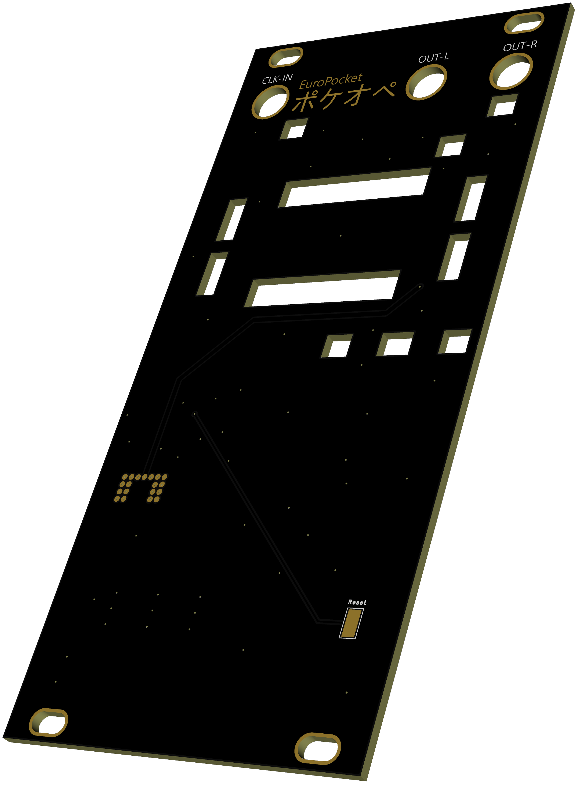
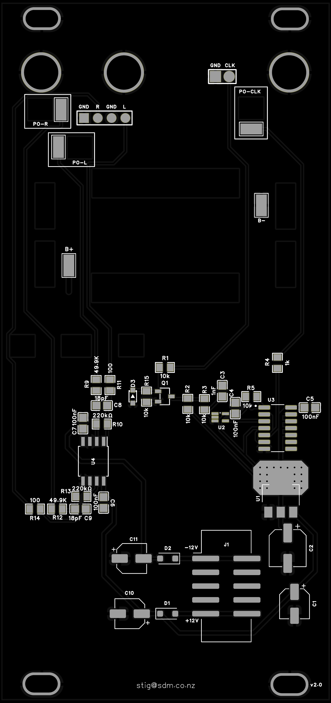
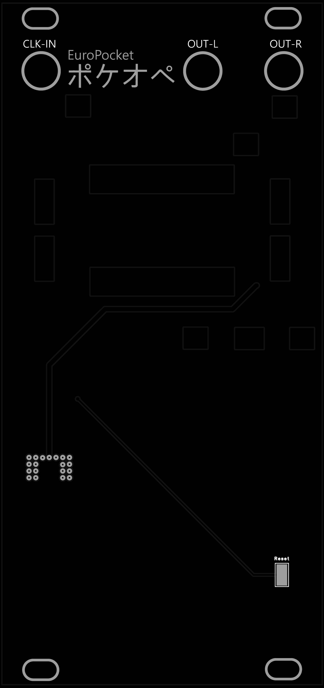

# europocket

A Eurorack module that interfaces a **Teenage Engineering Pocket Operator** with a
**Eurorack** modular system. The two domains differ in both clock rate and signal
levels, so the board provides two converters in one:

- **Clock converter** — takes a Eurorack clock/trigger on the input jack and produces
  a Pocket Operator compatible sync signal (÷2, 4 PPQN → 2 PPQN, 0–3.3 V).
- **Level converter** — takes the Pocket Operator's **left and right audio** and
  boosts it from line level to modular level on the two output jacks.

## Jacks

| Jack | Direction | Signal |
|------|-----------|--------|
| Clock in | Eurorack → board | Eurorack clock/trigger (up to ~10–12 V tolerated) |
| Audio out L | board → Eurorack | Pocket Operator left channel, boosted to ~10 Vpp modular level |
| Audio out R | board → Eurorack | Pocket Operator right channel, boosted to ~10 Vpp modular level |

The Pocket Operator connects via its sync/audio jacks: the converted sync clock goes
to the PO, and the PO's audio comes back into the board's two buffer channels.

## How it works

**Clock path:** Eurorack trigger → transistor input stage (level shift + protection,
Q1) → RC glitch filter → Schmitt trigger (74AHC1G14) → D flip-flop wired as a toggle
(74HC74, ÷2) → 1 kΩ series output → PO sync. A reset input (J5) connects to the
module's Play button and asynchronously clears the divider for deterministic restarts. Most Eurorack clocks run 4 PPQN; Pocket
Operators expect 2 PPQN, hence the divide-by-two.

**Audio path:** each channel is an inverting TL072 stage running from ±12 V,
gain ≈ ×4.41 (220 kΩ / 49.9 kΩ), taking the PO's measured ~2.2 Vpp output to
~9.7 Vpp. An 18 pF feedback cap rolls off above ~40 kHz — high enough to keep the
PO's square-wave edges crisp.

**Power:** ±12 V from the Eurorack bus (2×05 IDC header, Schottky reverse-polarity
protection). An LM1117 regulates +3.3 V locally for the logic; the TL072 runs
directly from ±12 V.

## Repository contents

| File | Description |
|------|-------------|
| [schematic.pdf](schematic.pdf) / [schematic.png](schematic.png) | Schematic |
| [pcb-top.png](pcb-top.png) / [pcb-bottom.png](pcb-bottom.png) | PCB renders |
| `europocket.eprj2` | EasyEDA Pro project file |
| `gerber/` | Fabrication outputs |
| `datasheets/` | Component datasheets |

## PCB

| Front | Back |
|-------|------|
|  |  |
