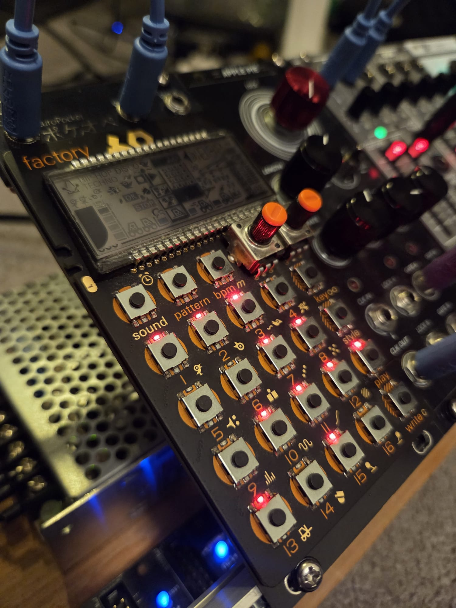
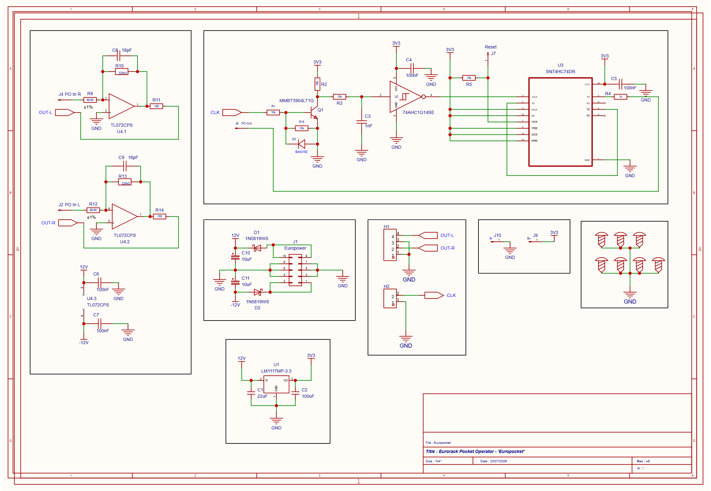

# europocket

A Eurorack module that interfaces a **Teenage Engineering Pocket Operator** with a
**Eurorack** modular system. The two domains differ in both clock rate and signal
levels, so the board provides two converters in one:

- **Clock converter** — takes a Eurorack clock/trigger on the input jack and produces
  a Pocket Operator compatible sync signal (÷2, 4 PPQN → 2 PPQN, 0–3.3 V).
- **Level converter** — takes the Pocket Operator's **left and right audio** and
  boosts it from line level to modular level on the two output jacks.

*The finished module in the rack, clocking and taking audio from a PO-32.*

## Jacks

| Jack | Direction | Signal |
|------|-----------|--------|
| Clock in | Eurorack → board | Eurorack clock/trigger (up to ~10–12 V tolerated) |
| Audio out L | board → Eurorack | Pocket Operator left channel, boosted to ~10 Vpp modular level |
| Audio out R | board → Eurorack | Pocket Operator right channel, boosted to ~10 Vpp modular level |

The Pocket Operator connects via its sync/audio jacks: the converted sync clock goes
to the PO, and the PO's audio comes back into the board's two buffer channels.

## Assembly

> ⚠️ **Use a hot-air rework station.** Attaching europocket requires desoldering the
> jacks from the back of the Pocket Operator. Hot air lifts them cleanly; an iron risks
> pulling the pads off the PO, which is not recoverable.

1. **Desolder the PO's jacks** from the back of the Pocket Operator.
2. **Bond the boards.** Position the europocket PCB on top of the Pocket Operator and
   join the two with **three small sections of 3M 4910F VHB Clear tape**.
3. **Connect the module to the PO.** Solder `PO-R`, `PO-L` and `PO-CLK` to the pads that
   appear in the same box on the Pocket Operator.
4. **Refit the jacks** to the module's own pads — `GND, R, GND, L` for audio and
   `GND, CLK` for the clock.
5. **Wire up Reset.** Solder `Reset` to the **bottom left pin of the Play button** on the
   front of the Pocket Operator, so the divider clears in step with the PO's transport.
6. **Power the PO from the module:**
   - `B−` → **top right** battery terminal
   - `B+` → **bottom left** battery terminal

The module supplies the Pocket Operator from its own +3.3 V regulator in place of the
AAA cells, so the PO runs whenever the rack is powered.

## Pocket Operator setup

Two settings on the PO must be correct or the module will appear dead. Both are
button chords on the master unit.

### Sync mode — set to SY2

> Hold **`key`** and press **`bpm`**. Press repeatedly to cycle through the modes.

**SY2** means *sync in, stereo audio out* — the mode this module expects. It takes the
board's converted clock on its sync input and returns both audio channels.

Pocket Operators share their 3.5 mm jacks between audio and sync, so the other SY modes
repurpose one or both output channels to carry the sync click instead of music. In those
modes the level converter's inputs see **silence**, and the module produces no output
even though every part of it is working correctly.

### Volume — set to full

> Hold **`bpm`** and press **key 16**.

The level converter's gain of ×4.41 is fixed, and it assumes the PO is running at full
output. The ~9.7 Vpp modular-level figure comes from the PO's measured **2.2 Vpp at
loudest volume** — at anything less, the module's output scales down proportionally and
won't reach Eurorack level.

## How it works

**Clock path:** Eurorack trigger → transistor input stage (level shift + protection,
Q1) → RC glitch filter → Schmitt trigger (74AHC1G14) → D flip-flop wired as a toggle
(74HC74, ÷2) → 1 kΩ series output → PO sync. The **Reset** input connects to the
module's Play button and asynchronously clears the divider for deterministic restarts.
Most Eurorack clocks run 4 PPQN; Pocket Operators expect 2 PPQN, hence the
divide-by-two.

**Audio path:** each channel is an inverting TL072 stage running from ±12 V,
gain ≈ ×4.41 (220 kΩ / 49.9 kΩ), taking the PO's measured ~2.2 Vpp output to
~9.7 Vpp. An 18 pF feedback cap rolls off above ~40 kHz — high enough to keep the
PO's square-wave edges crisp.

**Power:** ±12 V from the Eurorack bus (2×05 IDC header, Schottky reverse-polarity
protection). An LM1117 regulates +3.3 V locally for the logic; the TL072 runs
directly from ±12 V.

## Bill of materials

**Semiconductors**

| Qty | Reference | Part | Package | Purpose |
|-----|-----------|------|---------|---------|
| 1 | U1 | LM1117MP-3.3 | SOT-223 | +12 V → +3.3 V LDO |
| 1 | U2 | 74AHC1G14SE-7 | SOT-353 (SC-70-5) | Schmitt inverter |
| 1 | U3 | SN74HC74DR | SOIC-14 | Dual D flip-flop (÷2) |
| 1 | U4 | TL072CPS | SOIC-8W | Dual op-amp (level converter) |
| 1 | Q1 | MMBT3904LT1G (onsemi) | SOT-23 | NPN input transistor |
| 2 | D1, D2 | 1N5819WS | SOD-123F | Schottky, reverse-polarity protection |
| 1 | D3 | BAS316Z | SOD-323 | Q1 base clamp, negative inputs |

**Resistors** — all 0805

| Qty | Reference | Value | Purpose |
|-----|-----------|-------|---------|
| 5 | R1, R2, R3, R5, R15 | 10 kΩ | Base series, collector pull-up, RC filter, /CLR1 pull-up, base pulldown |
| 1 | R4 | 1 kΩ | Sync output series resistor |
| 2 | R9, R12 | 49.9 kΩ | Buffer input resistors |
| 2 | R10, R13 | 220 kΩ | Buffer feedback resistors (×4.41) |
| 2 | R11, R14 | 100 Ω | Buffer output series resistors |

**Capacitors**

| Qty | Reference | Value | Package | Purpose |
|-----|-----------|-------|---------|---------|
| 4 | C4, C5, C6, C7 | 100 nF | 0805 | Rail decoupling (+3.3 V ×2, +12 V, −12 V) |
| 2 | C8, C9 | 18 pF | 0805 | Buffer feedback caps (~40 kHz pole) |
| 1 | C3 | 1 nF | 0805 | RC filter |
| 1 | C1 | 22 µF | CP_Elec_5×5.3 | +12 V bulk |
| 2 | C10, C11 | 10 µF | CP_Elec_5×5.3 | ±12 V decoupling |
| 1 | C2 | 100 µF | CP_Elec_6.3×5.9 | +3.3 V bulk |

**Connectors and test points**

| Qty | Reference | Part | Purpose |
|-----|-----------|------|---------|
| 1 | J1 | IDC header 2×05 | Eurorack ±12 V / GND bus ("Europower") |
| 1 | H1 | 4-pad row | Audio out L/R + GND |
| 1 | H2 | 2-pin header 2.54 mm | Clock in + GND |
| 6 | J2, J4, J6, J7, J9, J10 | Test pad 4.0×2.0 mm | PO In L/R, PO CLK, Reset, B+, GND |

**Assembly consumables**

| Qty | Item | Purpose |
|-----|------|---------|
| 3 | 3M 4910F VHB Clear tape, small sections | Bonding the PCB to the Pocket Operator |

## Repository contents

| File | Description |
|------|-------------|
| [finished-module.jpg](finished-module.jpg) | Photo of the assembled module in a rack |
| [schematic.pdf](schematic.pdf) / [schematic.png](schematic.png) | Schematic |
| [pcb-top.png](pcb-top.png) / [pcb-bottom.png](pcb-bottom.png) | PCB renders |
| `europocket.eprj2` | EasyEDA Pro project file |
| `gerber/` | Fabrication outputs |
| `datasheets/` | Component datasheets |

## PCB

| Front | Back |
|-------|------|
|  |  |
